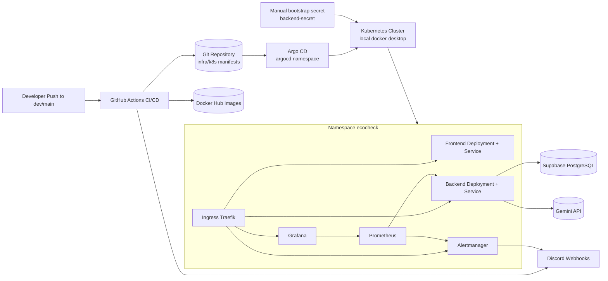

# EcoCheck Infrastructure Diagram

## Notes

- CI/CD updates image tags in GitOps manifests and pushes to the repository.
- Argo CD reconciles manifests into the active Kubernetes cluster.
- Runtime app secret `backend-secret` is intentionally bootstrapped in-cluster for local environment.
- Alerting is implemented via Prometheus rules + Alertmanager webhook receiver.
